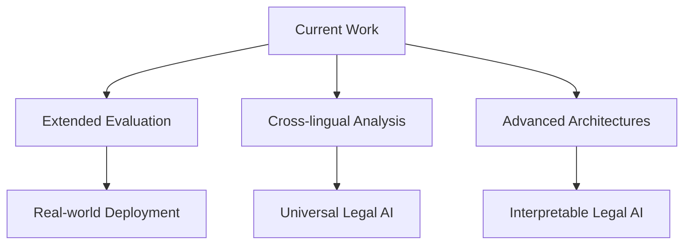

# ⚖️ Comparative Legal Judgment Prediction Using Statistical and Embedding-based Models

[](https://www.python.org/downloads/)
[](https://pytorch.org/)
[](https://huggingface.co/transformers/)
[](LICENSE)
[](Comparative_Legal_Judgment_Prediction_Using_Statistical_and_Embedding_based_Models.ipynb)

> **A comprehensive comparative study of traditional statistical methods vs. modern deep learning approaches for Legal Judgment Prediction**

---

## 📋 Table of Contents

- [🎯 Project Overview](#-project-overview)
- [🧠 Context and Background](#-context-and-background)
- [📊 Dataset](#-dataset)
- [🔬 Methodology](#-methodology)
- [📈 Results](#-results-and-performance-analysis)
- [🔮 Future Work](#-future-work-and-limitations)
- [🤝 Contributing](#-contributing-to-legal-ai)
- [📚 References](#-references)

## Project Overview

This project presents a comprehensive comparative analysis of **traditional statistical models** and **modern embedding-based deep learning approaches** for Legal Judgment Prediction (LJP), specifically focusing on criminal charge classification. The study evaluates the effectiveness of **TF-IDF + SVM** versus **BERT-based dual encoder** architectures in predicting criminal charges from case descriptions using the CAIL2018 dataset.

### 🔍 What makes this study unique?

- **Head-to-head comparison** of traditional vs. modern NLP approaches
- **Real-world legal dataset** with 200K+ Chinese court cases
- **Domain knowledge integration** using legal statute descriptions
- **Practical insights** for legal AI system design

### 🏆 Key Results at a Glance

| 📊 Model              | 🎯 Accuracy | ⚡ Speed | 💰 Cost | 🧠 Complexity |
| --------------------- | ----------- | -------- | ------- | ------------- |
| **TF-IDF + SVM**      | 96.00%      | ⚡⚡⚡   | 💰      | 🧠            |
| **BERT Dual Encoder** | 97.23%      | ⚡       | 💰💰💰  | 🧠🧠🧠        |

## 🧠 Context and Background

Legal Judgment Prediction (LJP) represents a critical intersection of **legal intelligence** and **artificial intelligence**, aiming to forecast judicial outcomes from textual case descriptions. This field has evolved from early quantitative analyses in the 1980s to sophisticated machine learning approaches, driven by the increasing digitization of legal documents and advances in Natural Language Processing (NLP) technologies.

### 🎯 Key Research Questions

This project addresses three core objectives:

> **1. 🔬 Assess Trade-offs Between Model Complexity and Performance**
>
> Investigating whether advanced deep learning models significantly outperform traditional statistical methods in terms of accuracy and robustness for legal text classification.

> **2. 🧩 Explore Domain-Specific Knowledge Integration**
>
> Evaluating how incorporating legal domain knowledge (such as legal articles) impacts model performance across both traditional and deep learning approaches.

> **3. 🎯 Contribute to Practical LJP System Design**
>
> Providing empirical insights into the strengths and limitations of statistical and embedding-based models to guide future research and development in LJP.

## 📊 Dataset

The project utilizes the **[CAIL2018 dataset](https://github.com/thunlp/CAIL)**, a publicly available benchmark dataset for Chinese legal judgment prediction. This dataset is particularly significant as one of the few large-scale, well-annotated, publicly accessible datasets that include real-world judicial case descriptions with structured judgment outcomes.

### 📈 Dataset Characteristics:

```
🏛️  Source: Chinese AI and Law (CAIL) Challenge
📊  Scale: ~2.68M criminal legal documents
⚖️  Coverage: 183 different charges under China's Criminal Law
🎯  Focus: Top 5 most frequent charges (30K samples)
```

| Subset             | Training | Validation | Test   | Total |
| ------------------ | -------- | ---------- | ------ | ----- |
| **CAIL2018-Small** | 154,592  | 17,131     | 32,508 | ~200K |
| **CAIL2018-Large** | -        | -          | -      | >1.5M |

### 🏷️ Target Classes (Top 5 Criminal Charges)

| 🏷️ Label | 中文                         | English             | 📊 Entries |
| -------- | ---------------------------- | ------------------- | ---------- |
| 0        | 盗窃                         | Theft               | 10000+     |
| 1        | [走私、贩卖、运输、制造]毒品 | Drug-related crimes | 8000+      |
| 2        | 故意伤害                     | Intentional injury  | 6000+      |
| 3        | 抢劫                         | Robbery             | 5000+      |
| 4        | 诈骗                         | Fraud               | 3000+      |

### 🔄 Data Preprocessing Pipeline


<details>
<summary>📋 <strong>Click to expand preprocessing steps</strong></summary>

1. **🧹 Text Cleaning**: Removal of URLs, mentions, hashtags, and non-Chinese characters
2. **✂️ Tokenization**: Using jieba library for Chinese word-level tokenization
3. **🚫 Stopword Removal**: Filtering common Chinese stopwords
4. **🔢 Label Encoding**: Converting text labels to numerical format
5. **📊 Dataset Flattening**: Converting multi-label cases to single-label instances

</details>

## 🔬 Methodology

We compare two fundamentally different approaches to legal text classification:

### 🏛️ Model 1: Statistical Baseline (TF-IDF + SVM)

```python
# Traditional approach
TfidfVectorizer(max_features=5000, ngram_range=(1,2))
SVC(kernel='linear', C=1.0)
```

**Architecture Overview:**

```
Text → TF-IDF Vectors → Linear SVM → Prediction
```

| 🎯 Aspect               | 📝 Details                                    |
| ----------------------- | --------------------------------------------- |
| **Text Representation** | TF-IDF vectorization (5K features, 1-2 grams) |
| **Classifier**          | Linear kernel SVM (C=1.0)                     |
| **✅ Advantages**       | Simplicity, interpretability, speed           |
| **🎯 Best for**         | Well-structured, balanced datasets            |

### 🤖 Model 2: Embedding-based Deep Learning (BERT Dual Encoder)

```python
# Modern approach
BertModel.from_pretrained("google-bert/bert-base-chinese")
# + Dual encoder architecture + Contrastive learning
```

**Architecture Overview:**

```
Facts → BERT Encoder ↘
                      → Contrastive Loss → Prediction
Statutes → BERT Encoder ↗
```

<details>
<summary>🔧 <strong>Technical Architecture Details</strong></summary>

| 🎯 Component              | 📝 Configuration                     |
| ------------------------- | ------------------------------------ |
| **Base Model**            | BERT-base-Chinese                    |
| **Architecture**          | Dual encoder framework               |
| **Knowledge Integration** | Legal statute descriptions           |
| **Loss Function**         | Symmetric contrastive loss (InfoNCE) |
| **Optimizer**             | AdamW (lr=2e-5)                      |
| **Scheduler**             | Linear warmup (10%) + decay          |
| **Training**              | 10 epochs, early stopping            |
| **Batch Size**            | 16 (train), 32 (eval)                |

**🧠 Key Innovation: Domain Knowledge Integration**

- Encodes both case facts AND legal statutes
- Learns shared semantic space for fact-statute matching
- Leverages legal domain expertise

</details>

## 📈 Results and Performance Analysis

### 🏆 Quantitative Results

| 🤖 Model              | 🎯 Accuracy   | 📊 Macro F1   | ⚖️ W-Precision | 🔍 W-Recall   | 📈 W-F1       | 🚀 Speed | 💰 Cost |
| --------------------- | ------------- | ------------- | -------------- | ------------- | ------------- | -------- | ------- |
| **TF-IDF + SVM**      | **96.00%**    | **95.73%**    | **96.00%**     | **96.00%**    | **96.00%**    | ⚡⚡⚡   | 💰      |
| **BERT Dual Encoder** | **97.23%** ✨ | **96.83%** ✨ | **97.23%** ✨  | **97.23%** ✨ | **97.23%** ✨ | ⚡       | 💰💰💰  |

> 💡 **Key Insight**: Only **1.23% accuracy improvement** with **significant computational cost increase**

### 🔍 Key Findings

<table>
<tr>
<td width="50%">

#### 📊 **Performance Gap Analysis**

- **Marginal Difference**: Both models show strong performance
- **Cost-Benefit**: Traditional model offers excellent ROI
- **Semantic Edge**: BERT better handles similar crime types

</td>
<td width="50%">

#### 🧠 **Semantic Understanding**

- **Theft vs Robbery**: BERT makes 38% fewer errors (79 vs 129)
- **Drug Crimes**: Both models achieve near-perfect accuracy
- **Pattern Recognition**: Clear linguistic signatures for certain crimes

</td>
</tr>
</table>

### 🎭 Confusion Matrix Analysis

Both models struggle primarily with semantically similar crimes:

```
🔄 Common Confusions:
   盗窃 (Theft) ↔ 抢劫 (Robbery)    [Violence vs Non-violence]
   盗窃 (Theft) ↔ 诈骗 (Fraud)      [Property crimes overlap]
```

**🎯 BERT's Advantage**: Better discrimination between semantically close categories through contextual understanding.

### 📊 When to Choose Each Model

<table>
<tr>
<th>🏛️ Choose TF-IDF + SVM when:</th>
<th>🤖 Choose BERT when:</th>
</tr>
<tr>
<td>

✅ **Quick deployment needed**  
✅ **Limited computational resources**  
✅ **Interpretability required**  
✅ **Clean, structured data**  
✅ **Balanced class distribution**

</td>
<td>

✅ **Maximum accuracy critical**  
✅ **Complex, noisy data**  
✅ **Semantic nuances important**  
✅ **Computational resources available**  
✅ **Long-tail distributions**

</td>
</tr>
</table>

## 🔮 Future Work and Limitations

### 🚧 Current Limitations:

| ⚠️ Limitation                 | 📝 Description                           | 🎯 Impact                        |
| ----------------------------- | ---------------------------------------- | -------------------------------- |
| **Dataset Scope**             | Limited to 5 most frequent charges       | Reduced complexity               |
| **Language Specificity**      | Chinese legal system focus               | Limited generalizability         |
| **Computational Constraints** | Limited BERT hyperparameter optimization | Potential performance gap        |
| **Evaluation Scope**          | Single domain evaluation                 | Unknown cross-domain performance |

### 🚀 Future Directions:

<table>
<tr>
<td width="50%">

#### 🎯 **Model Improvements**

- 🌍 **Cross-lingual Analysis**: Extend to other legal systems
- 🏗️ **Advanced Architectures**: Legal-specific transformers
- 🔍 **Interpretability**: Explainable AI for legal decisions
- ⚖️ **Fairness**: Bias detection and mitigation

</td>
<td width="50%">

#### 📊 **Evaluation Extensions**

- 📈 **Challenging Datasets**: Class imbalance scenarios
- 🌐 **Real-world Deployment**: Production system testing
- 🎭 **Multi-task Learning**: Simultaneous prediction tasks
- 📋 **Longitudinal Studies**: Performance over time

</td>
</tr>
</table>

### 💡 Research Opportunities



## 🤝 Contributing to Legal AI

This work contributes to the broader field of **legal artificial intelligence** by:

### 🎯 Impact Areas

<table>
<tr>
<td width="50%">

#### 📊 **Research Contributions**

- 🔬 **Empirical Evidence**: Concrete performance comparisons
- 🛠️ **Methodology**: Robust model comparison framework
- 📈 **Benchmarking**: Standardized evaluation protocols

</td>
<td width="50%">

#### 💼 **Practical Applications**

- 🏛️ **Judicial Support**: Automated case classification
- ⚖️ **Legal Advisory**: Decision support systems
- 📋 **Document Review**: Efficient case processing

</td>
</tr>
</table>

### 🌟 Key Contributions

> **💡 Resource Efficiency**: Demonstrating that simpler models can be competitive under certain conditions

> **🎯 Practical Guidance**: Offering decision criteria for model selection in legal applications

> **🔬 Methodology Framework**: Establishing reproducible comparison standards for LJP research

> **⚖️ Real-world Insights**: Bridging the gap between academic research and practical legal AI deployment

### 🏆 Recognition & Impact

- **📚 Educational Value**: Comprehensive tutorial for legal NLP beginners
- **🔄 Reproducibility**: Full code and methodology documentation
- **🌐 Open Science**: Public dataset and transparent evaluation
- **🤝 Community**: Foundation for collaborative legal AI research

## 📚 References

This project builds upon extensive research in **legal judgment prediction**, **natural language processing**, and **machine learning**. Key research areas include:

### 📖 Core Research Areas

- 🤖 **Recent advances in BERT-based legal text analysis**
- 📊 **Traditional statistical methods in legal informatics**
- 🧠 **Domain-specific knowledge integration approaches**
- ⚖️ **Comparative studies in legal AI systems**

> 📋 **Full reference list with 13+ academic papers available in the [Jupyter notebook](Comparative_Legal_Judgment_Prediction_Using_Statistical_and_Embedding_based_Models.ipynb)**

### 🔑 Key Datasets & Resources

- **[CAIL2018](https://github.com/thunlp/CAIL)**: Chinese AI and Law Challenge Dataset
- **[Hugging Face Transformers](https://huggingface.co/transformers/)**: BERT model implementations
- **[Jieba](https://github.com/fxsjy/jieba)**: Chinese text segmentation library

## 📄 License and Citation

<table>
<tr>
<td width="70%">

### 📜 License Information

- **Purpose**: Educational use (CM3060 NLP Course)
- **Dataset**: CAIL2018 under original license terms
- **Code**: Available for academic and educational purposes
- **Attribution**: Please cite appropriately when using this work

</td>
<td style="width: 30%; word-wrap: break-word;">

### 🎓 Academic Citation

```bibtex
@misc{wu2025legaljudgment,
  title={Comparative Legal Judgment Prediction Using Statistical and Embedding-based Models},
  author={Wu, Yue},
  year={2025},
  howpublished={\url{https://github.com/lothronx/cm3060-comparative-legal-judgment-prediction}},
  note={CM3060 Natural Language Processing Course Project},
  month={June}
}
```

</td>
</tr>
</table>

---

<div align="center">

### 🔗 Connect with the Author

[](https://www.linkedin.com/in/yuewuxd/)

**Made with ❤️ for the Legal AI Community**

📊 _For detailed implementation, complete results, and technical specifications, please refer to the [accompanying Jupyter notebook](Comparative_Legal_Judgment_Prediction_Using_Statistical_and_Embedding_based_Models.ipynb)._

</div>
